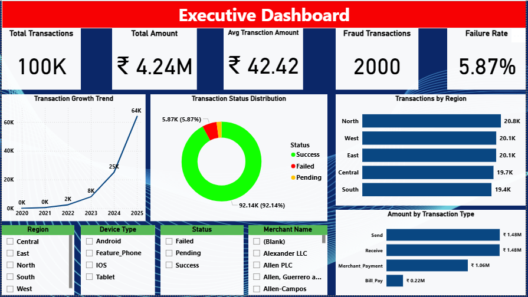
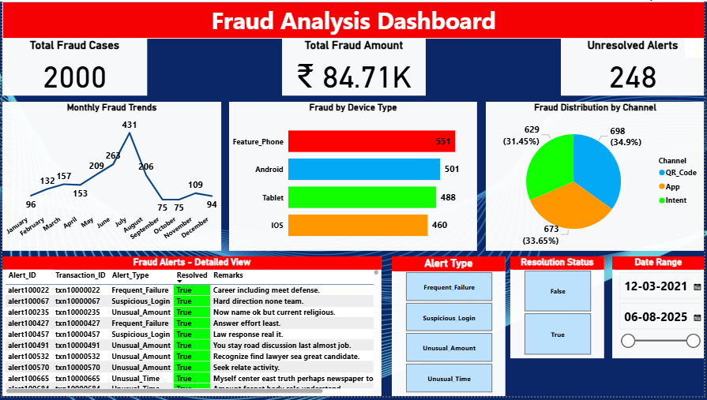

# 💳 UPI Fraud & Transaction Analysis – SQL | Python | Power BI

_An end-to-end data analytics project analyzing UPI transactions, identifying fraud patterns, studying customer & merchant behaviour, and building an executive dashboard._

---

<h2 id="toc">📌 Table of Contents</h2>
<ul>
  <li><a href="#overview">Overview</a></li>
  <li><a href="#business-problem">Business Problem</a></li>
  <li><a href="#tools-tech">Tools & Technologies</a></li>
  <li><a href="#project-structure">Project Structure</a></li>
  <li><a href="#data-cleaning">Data Validation & Cleaning</a></li>
  <li><a href="#python-eda">Python EDA & Analysis</a></li>
  <li><a href="#sql-db">SQL Database Design</a></li>
  <li><a href="#dashboards">Dashboards</a></li>
  <li><a href="#insights">Key Insights</a></li>
  <li><a href="#recommend">Recommendations</a></li>
  <li><a href="#author">Author</a></li>
</ul>

---

<h2 id="overview">📘 Overview</h2>

This project analyzes UPI transaction behaviour using <b>SQL</b>, <b>Python</b>, and <b>Power BI</b>, focusing on fraud detection, failed transactions, high-risk devices, merchant behaviour, customer analytics, and dashboard reporting.

---

<h2 id="business-problem">🧩 Business Problem</h2>
<ul>
  <li>Fraud risk</li>
  <li>Transaction failures</li>
  <li>High-risk devices</li>
  <li>Merchant disputes</li>
  <li>Customer churn</li>
  <li>Compliance & KYC issues</li>
</ul>

---

<h2 id="tools-tech">🛠 Tools & Technologies</h2>
<ul>
  <li>MySQL</li>
  <li>Python (Pandas, Seaborn, Matplotlib, SciPy)</li>
  <li>Power BI Desktop</li>
  <li>Excel</li>
  <li>Git & GitHub</li>
</ul>

---

<h2 id="project-structure">📁 Project Structure</h2>

<pre>
UPI_Transactions_Analysis/
│
├── README.md
├── .gitignore
│
├── Images/
│   ├── Dashboard.png
│   └── Dashboard1.png
│
├── Notebook/
│   ├── Capstone Project.ipynb
│   └── Capstone Report Chart.ipynb
│
├── Power_BI/
│   └── Capstone_Project.pbix
│
├── PPT_Presentation/
│   └── Capstone_Project_Report.pptx
│
├── Report/
│   └── Capstone_Project_Report.pdf
│
├── SQL_Database/
│   ├── upi_project_customer_feedback_surveys.csv
│   ├── upi_project_customer_master.csv
│   ├── upi_project_device_info.csv
│   ├── upi_project_fraud_alert_history.csv
│   ├── upi_project_merchant_info.csv
│   ├── upi_project_upi_account_details.csv
│   └── upi_project_upi_transaction_history.csv
</pre>

---

<h2 id="data-cleaning">🧼 Data Validation & Cleaning</h2>
<ul>
  <li>Missing values flagged</li>
  <li>Date formatting corrected</li>
  <li>Device & merchant codes validated</li>
  <li>Duplicate transactions removed</li>
  <li>Fraud flags and KYC issues verified</li>
  <li>Data Quality Log prepared</li>
</ul>

---

<h2 id="python-eda">🐍 Python EDA & Analysis</h2>
<ul>
  <li>Trend analysis</li>
  <li>Customer segmentation</li>
  <li>Device fraud ratios</li>
  <li>Merchant performance</li>
  <li>Failure-rate analysis</li>
  <li>Outlier detection</li>
  <li>Heatmaps</li>
  <li>Hypothesis testing (ANOVA, t-test, chi-square)</li>
</ul>

---

<h2 id="sql-db">🗄 SQL Database Design</h2>
<ul>
  <li>customer_master</li>
  <li>device_info</li>
  <li>upi_account_details</li>
  <li>merchant_info</li>
  <li>upi_transaction_history</li>
  <li>fraud_alert_history</li>
  <li>customer_feedback_surveys</li>
</ul>

---

<h2 id="dashboards">📊 Dashboards</h2>

<h3>🔵 Dashboard 1 – Executive Overview</h3>

<h3>🔴 Dashboard 2 – Fraud Analysis</h3>

---

<h2 id="insights">🌟 Key Insights</h2>
<ul>
  <li>Rooted devices show higher fraud attempts</li>
  <li>Merchant category affects fraud & failures</li>
  <li>High-risk customers often give negative feedback</li>
  <li>High-value transactions show more fraud flags</li>
  <li>Certain regions show higher failure spikes</li>
</ul>

---

<h2 id="recommend">💡 Recommendations</h2>
<ul>
  <li>Implement device-risk scoring</li>
  <li>Improve merchant verification</li>
  <li>Push awareness alerts</li>
  <li>Monitor high-value transactions strictly</li>
  <li>Automate fraud-flag detection</li>
</ul>

---

<h2 id="author">👤 Author</h2>
<b>Nitish Sharma</b> 
📧 Email: <b>nitishsharma.id@gmail.com</b> 
🔗 GitHub: https://github.com/NitishSharma77/ 
🔗 LinkedIn: https://www.linkedin.com/in/nitish-sharma7/ 

⭐ Did you like the project? Consider giving the repository a STAR!

